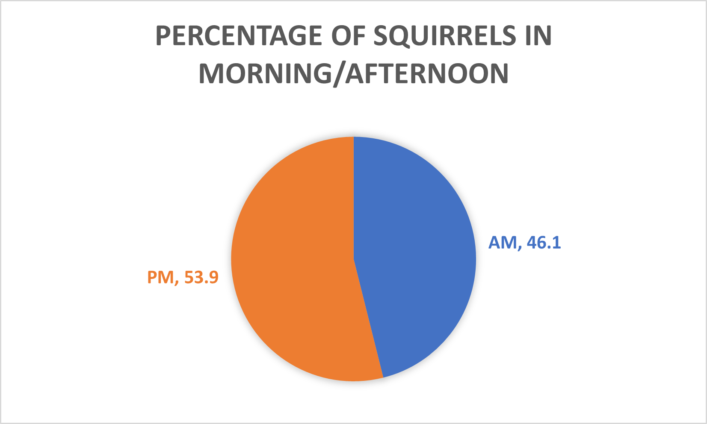

# So You Want To Pet A Squirrel

It’s a common desire. There’s only one problem: they’re fast. Our ancestors solved this through cunning traps or hand-raising a kitten (yes, really) from birth. Luckily, modern technology has graced us with a much less time-consuming solution: data-driven analytics. A few years ago, a group of people with frankly too much time on their hands spent several days walking through Central Park in New York City, recording every squirrel they saw. 

<h3> Example squirrel</h3>

Luckily for us, they also recorded if the squirrels attempted to approach them to ask for food. With this information, and a little bit of code in SQL and visualization in Tableau, we can determine the best time and place to find a pettable squirrel. Code is located in the repository and the Tableau visualization can be found [here.](https://public.tableau.com/app/profile/jonathan.vincent5335/viz/FriendlySquirrels/Sheet1#1)

## FAQs 

**1. I’m extremely prepared, and I read that squirrels are most active during the day. Is there a certain time of day I should go to the park to maximize my chances?**

Nope! Our nice data collectors recorded whether they saw the squirrels in the morning or afternoon, and there’s no real difference. Go whenever you want. 

**2. Can I pet a baby?** 

Sure! Around 20% of the squirrels recorded were juveniles. Luckily for you, among the friendly squirrels, the proportion was the same. 

**3. What can I feed my new squirrel buddy?**

Squirrels enjoy natural foods like whole nuts and seeds (walnuts, sunflower seeds, acorns), vegetables (peas, zucchini, broccoli) and Oreo® cookies. 

**4. Are most squirrels friendly?**

Alas, no. Of the squirrels in our dataset, only around 6% willingly approached the data collectors. Of course, the data collectors weren’t trying to pet a squirrel, just find them. If you wander around with a handful of nuts, you’ll probably improve your odds. 

**5. If I wander around the park at random, how likely am I to find a friendly squirrel?** 

Depends how much time you want to put in! According to the New York Times, one squirrel census shift lasted around twenty minutes. With a bit of help from SQL, we can see that in one shift, an average volunteer saw 5 squirrels, so roughly one squirrel every four minutes. 

Given that 6% of the squirrels are friendly, we can calculate a nice smooth cumulative probability curve. What’s clear here is that if you spend an hour in the park, you will most likely find a friendly squirrel (~60% odds). Spend two, and your odds jump up to over 80%. That’s pretty good. 

INSERT PIC

However, we can’t have a guarantee that the first friendly squirrel will want to let you pet it. Let’s imagine a few scenarios, where say only one in two, three, and five friendly squirrels wants a pet. 

It’s still not bad if only half the friendly squirrels want pets, but if only one in three or five do then you might be wandering the park for a while. Add to this that we don’t actually know the true percentage of pettable squirrels, and it looks like we’d best be strategic. 

Luckily, our squirrel census takers included their longitude and latitude everytime they spotted a squirrel. With this information (and a little help from Tableau), we can find the friendly squirrel hotspots. If you want, there’s an [interactive map on Tableau public with information on each squirrel](https://public.tableau.com/app/profile/jonathan.vincent5335/viz/FriendlySquirrels/Sheet1#1).

INSERT PIC

So, it looks like your best bet is to head to the southern part of the park. There’s a big cluster of friendly squirrels around the intersection of West 59th Street and Central Park (near Umpire Rock) and a second a bit further north, in a section of park called the Ramble. 

INSERT PICS OF THEM HERE

Good luck!

